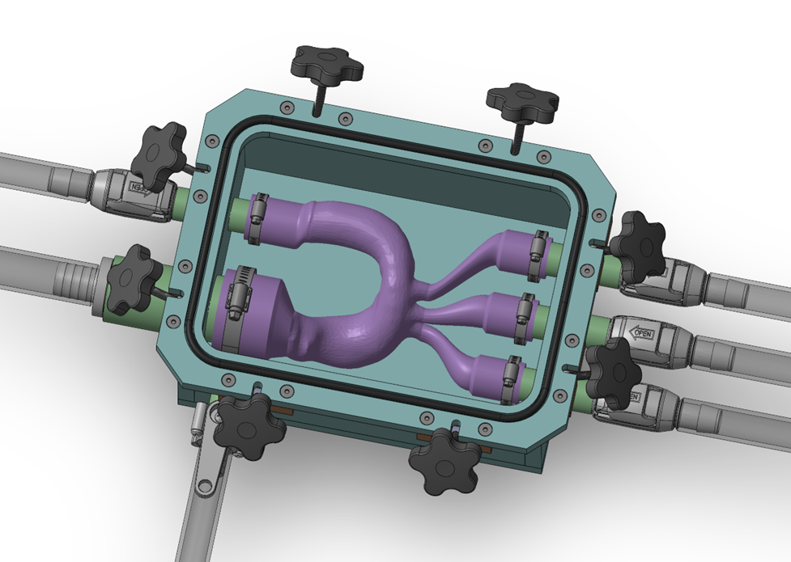
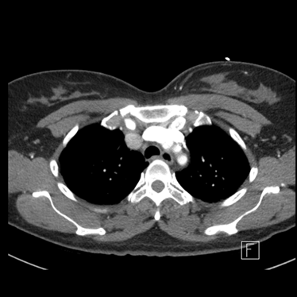
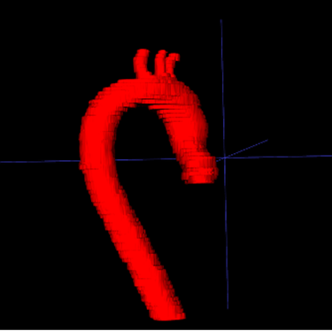
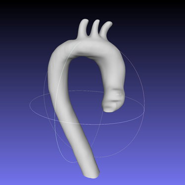

# Design of an Anatomically Correct Dynamic Phantom for the TAVR Procedure

A capstone mechanical engineering design project focused on developing a **patient-specific, pressurizable aortic phantom** for **bench-top flow studies** and **imaging validation** in the context of **TAVR (Transcatheter Aortic Valve Replacement)**.

  

## Overview

This project aims to bridge the gap between medical imaging, manufacturable geometry, and experimental cardiovascular testing. Starting from clinical CT data, the aortic geometry is segmented, converted into a printable model, fabricated using SLA printing, and integrated into a sealed experimental fixture for controlled hemodynamic studies.

The final system is intended to support:
- experimental flow visualization,
- validation of computational and physics-informed models,
- and realistic bench-top investigation of aortic behavior relevant to TAVR.

## Key Highlights

- **Patient-specific geometry** extracted from clinical CT data
- **Segmentation workflow** using ITK-SNAP
- **Printable STL generation** for additive manufacturing
- **SLA-fabricated aortic phantom**
- **Pressurizable housing** designed for controlled experimental testing
- **Interactive 3D geometry visualization** on the project website

## Geometry Development Pipeline

The geometry workflow follows three main stages:

1. **Raw CT data**
2. **Aorta segmentation**
3. **Print-ready STL model**

  
  
  

This pipeline transforms medical image data into a manufacturable phantom geometry suitable for physical testing.

## Experimental System

The test platform combines:
- a 3D-printed aortic phantom,
- a fluid path for flow studies,
- and a sealed enclosure capable of pressurization to better emulate physiological conditions.

The assembly is designed to provide a stable experimental platform for future validation studies.

## Website

The project website includes:
- a concise project summary,
- visual documentation of the geometry pipeline,
- system images,
- and an interactive 3D model viewer.

**Project page:**  
[View the website](https://yingtongl1023.github.io/McGill_MECH_ENG_Capstone_Project/)

## Team

- Aidan Bouden  
- Glen Gaige  
- Yingtong Luo  
- Elaine Yang  

**Advisor:** Prof. Rosaire Mongrain  
Department of Mechanical Engineering, McGill University

## Acknowledgements

We gratefully acknowledge the support of collaborators, technical staff, and instructors who contributed to the development, fabrication, and refinement of this project.

---

  Mechanical Engineering Design Project · McGill University

